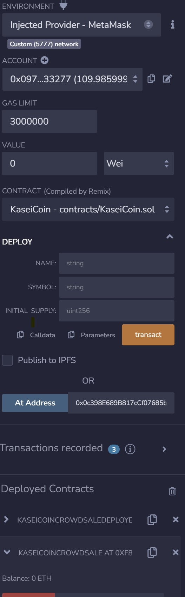
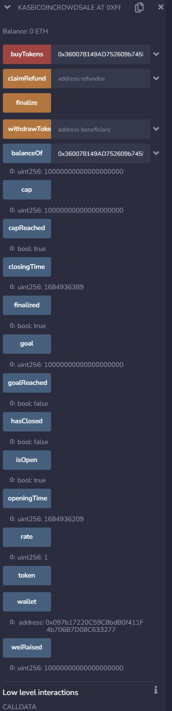
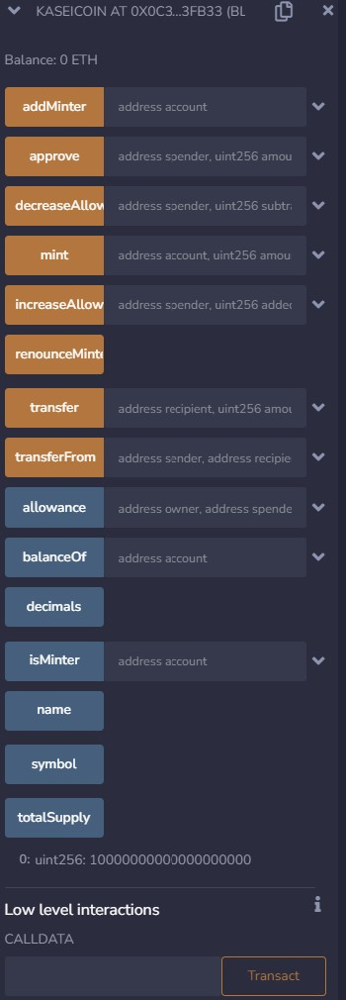

# Module 21 Advanced Solidity Assignment

## Steps

- Make sure ganache accounts are connected to metamask - you need more than 1  account in order to complete the purpose.
- Compile both files and deploy the deployer contract first, then after that seeing the contract in the righthand side, you can get and use the addresses of crowdsale contract and token contract then copy it and paste it to At Address function. Before that, make sure remix is connected to metamask accounts.
- Test out the functionality, especically the one in the KaseinCoinCrowdsale smart contract and check if it's true to condition pre-finalization e.g. isOpen (true), finalized (false), wallet (deployer account), etc.
- Then test out buyToken function using other account than the one you use to raise contract (deployer). 
- Make sure the amount you pay for the token reach the cap, that you have set when deploying the deployer smart contract.
- When the goal reached and closing time has passed, you can finalize it and check the function finalized become "true".
- You can also check the history of transaction in metamask, ganache or even check the balance of your buying account in the balanceOf function.  

## Link to Video 

https://drive.google.com/file/d/1D6MUXIgfhbmDmAFLfRxwf-AAWPlbZyA5/view?usp=share_link

## Photos

